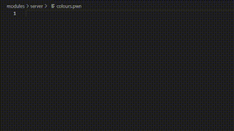

# PAWN Painter

PAWN Painter is a Visual Studio Code extension that enhances PAWN development with integrated color picking and preview features. It supports standard hexadecimal color formats and SA-MP/open.mp GameText color codes.

## Features

- Supports multiple hex color formats:
  - `0xRRGGBB`
  - `0xRRGGBBAA`
  - `{RRGGBB}`
  - `RRGGBB`
- Supports SA-MP/open.mp GameText colors:
  - Basic colors: `~r~`, `~g~`, `~b~`, `~y~`, `~p~`, `~w~`, `~l~`
  - Brightness levels with `~h~` (e.g., `~r~~h~` for a brighter red)

## Usage

The extension automatically activates for files with the following extensions:
- `.pwn`
- `.inc`
- `.p`
- `.pawno`

## Configuration

You can configure the extension through VS Code extension settings:
- **Toggle Normal Colour Picker** (`pawnpainter.toggleNormalColorPicker`): Enabled by default
- **Toggle GameText Colour Picker** (`pawnpainter.toggleGameTextColorPicker`): Disabled by default but can be enabled at will

## Showcase



To test, copy this code, paste into a file and save it as a pwn file:

```pawn
// ???????????????? Normal Color Formats ????????????????
0xAC2424      // Hex: 0xRRGGBB
0x861919AA    // Hex: 0xRRGGBBAA
0x40533700    // Hex: 0xRRGGBBAA, alpha set to 0
{8D1717}      // Curly braces: RRGGBB
5F0C0C        // Plain hex: RRGGBB

// ???????????????? GameText Colors ????????????????
~r~Red
~r~~h~Light Red
~r~~h~~h~Red Pink
~r~~h~~h~~h~Dark Pink
~r~~h~~h~~h~~h~Light Red Pink
~r~~h~~h~~h~~h~~h~Pink
~g~Green
~g~~h~Light Green
~g~~h~~h~More Light Green
~g~~h~~h~~h~Sea Green
~g~~h~~h~~h~~h~Offwhite
~b~Blue
~b~~h~Purplish Blue
~b~~h~~h~Light Blue
~b~~h~~h~~h~Dark Blue
~y~Yellow
~y~~h~Light Yellow
~y~~h~~h~Offwhite
~p~Purple
~p~~h~Medium Pink
~w~White
~l~Black

// ???????????????? Examples ????????????????
#define COLOR_RED_EMBED "{FF0000}"
#define COLOR_RED_HEX "FF0000"

SendClientMessage(playerid, -1, "{FFFFFF}Hello, this is {00FF00}green {FFFFFF}and this is {FF0000}red.");
SendClientMessage(playerid, 0xFF0000FF, "This is a cool extension!");

~r~This ~r~~h~is ~r~~h~~h~an ~g~example ~g~~h~of ~y~~h~~h~colorful ~p~~h~text!
```

## Download

You can download PAWN Painter from the Visual Studio Marketplace: [Download PAWN Painter](https://marketplace.visualstudio.com/items?itemName=itsneufox.pawn-painter)

## Contributing

Contributions are welcome! Please feel free to submit a Pull Request.

## License

This project is licensed under the MIT License - see the [LICENSE](LICENSE) file for details.

## Author

Created and maintained by [itsneufox](https://github.com/itsneufox)